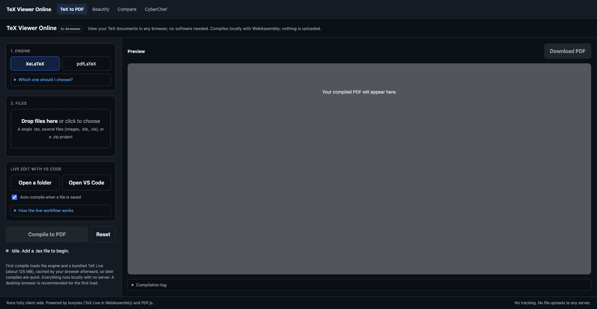
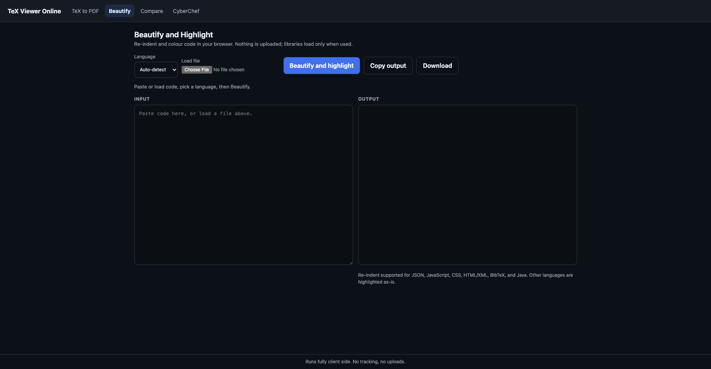
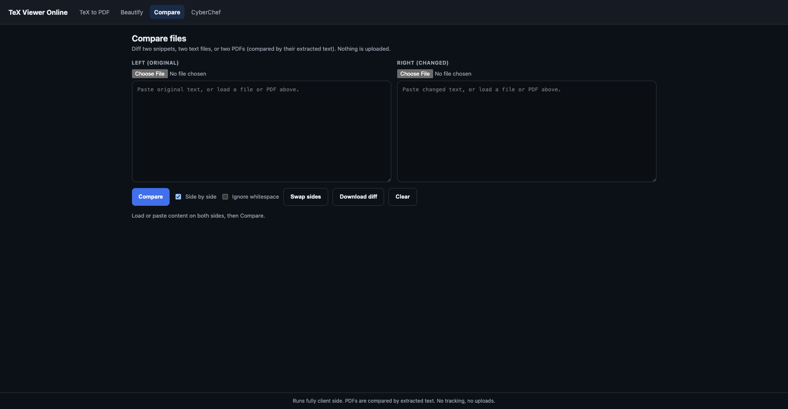
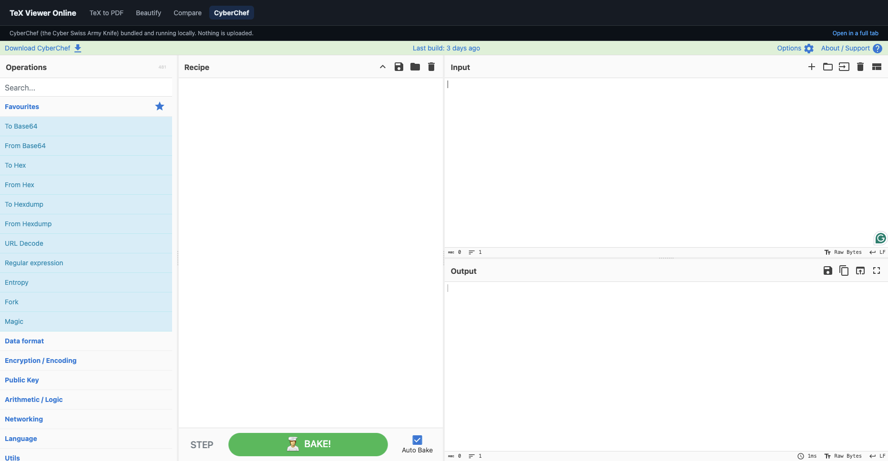

# tex2pdf

**TeX Viewer Online. View your TeX documents in any browser, no software needed.**

[](https://doi.org/10.5281/zenodo.20708417)

Compile LaTeX and view it as a PDF, entirely in your browser. No account, no install, no server, and nothing is uploaded. Drop in a `.tex` file and get a PDF back. The TeX engine is bundled as WebAssembly and runs inside the page.

Live website: https://devharsh.github.io/tex2pdf/



## In-browser tools

Alongside the TeX viewer, the site bundles small client-side utilities. Each lives on its own page so its code loads only when you open it, keeping memory and first paint low. Everything runs in your browser; nothing is uploaded.

### TeX to PDF (`index.html`)

The flagship viewer (shown above). Upload a single `.tex`, several files, or a `.zip`, choose XeLaTeX or pdfLaTeX, and preview the PDF inline with a one-click download. Includes automatic main-file detection, an elapsed timer and progress bar, and live VS Code folder sync so the PDF rebuilds as you save.

### Markdown to PDF (`html/md2pdf.html`)

Render a Markdown file and save it as a PDF, entirely in the browser. It handles GitHub-flavored Markdown (tables, task lists, strikethrough), highlights code, and renders math with KaTeX. Load or drag in a `.md` file, or paste text, then Save as PDF (through the print dialog), download the HTML, copy it, or clear. Its libraries load on demand and nothing is uploaded.

### Beautify and highlight (`html/beautify.html`)

Re-indent and colour code entirely in the browser. It auto-detects the language and reformats JSON, JavaScript, CSS, HTML/XML, BibTeX, and Java, and adds syntax highlighting for Python, C, C++, and C# as well. Load a file or paste text, then copy, download, or clear the result.



### Compare (`html/diff.html`)

A side-by-side diff of two snippets, two text files, or two PDFs (compared by their extracted text). Toggle whitespace handling, swap sides, download the differences as a `.diff` file, or clear both sides.



### CyberChef (`html/cyberchef.html`)

The bundled Cyber Swiss Army Knife (by GCHQ) for encoding, encryption, compression, data formats, and hundreds of other operations, running locally with no server. Its modules load on demand when you open the tool.



## Why

Most LaTeX setups need a local TeX install or a cloud service that uploads your files. tex2pdf does neither. A TeX engine (busytex) plus a TeX Live package set are shipped as static files and run client side, so compilation is private and self contained.

## Features

- Upload a single `.tex` file, several files together (figures, `.bib`, `.cls`), or a `.zip` project.
- Two engines: XeLaTeX (default, most reliable here) and pdfLaTeX.
- The basic TeX Live set plus extra packages bundled separately (booktabs, enumitem, url) so common documents compile out of the box.
- Automatic main-file detection, with a picker when a project has more than one `.tex`.
- Live elapsed timer and progress bar during loading and compilation.
- Inline preview of every page, plus a one-click PDF download.
- BibTeX runs automatically when a `.bib` file is present.
- Responsive layout and keyboard-accessible controls. Custom 404 page.

## Choosing an engine

Keep the default, **XeLaTeX**. In this in-browser engine it handles fonts most reliably because it uses vector fonts directly.

Use **pdfLaTeX** only if you prefer it. It is slightly faster, but it can fail when a document needs a bitmap font it must build on the fly, which is not possible in WebAssembly (you will see a font or `mktexpk` error in the log). If that happens, switch back to XeLaTeX and compile again.

## Using it

1. Open the site.
2. Leave the engine on XeLaTeX (or pick pdfLaTeX).
3. Drag in your `.tex` file, multiple files, or a `.zip` of your project.
4. If there is more than one `.tex`, pick the main one (the file with `\documentclass`).
5. Click Compile to PDF. The preview appears on the right; use Download PDF to save it.

The first compile loads the engine and TeX Live (about 125 MB). Your browser caches it, so later compiles are fast (a few seconds).

## Live editing with VS Code

You can keep your usual editor and have the PDF rebuild as you save, with no upload:

1. Click **Open a folder** and choose your project folder (grant read access once).
2. Click **Open VS Code**, then in vscode.dev choose File, Open Folder, and pick the same folder.
3. Edit and save in VS Code. This tool watches the folder and recompiles automatically on each save (toggle with "Auto-compile when a file is saved").

This uses the browser File System Access API and works in Chrome and Edge. In other browsers the button is disabled and you can still upload files manually.

## How it works

Your files are read with the browser File API and written into the engine's in-memory filesystem. busytex, a WebAssembly build of TeX Live, compiles them in a Web Worker. The bundled TeX Live "basic" set is served as static files; a few common packages that are not in basic live in `core/texmf/` and are written into the project at compile time. The resulting PDF bytes are rendered with PDF.js. Nothing is uploaded or stored.

## Package coverage

The bundled basic tier already includes the LaTeX kernel, article/report/book classes, amsmath, amssymb, geometry, graphics, hyperref and its dependencies, and many more. The full TeX Live (the "extra" tier, ~340 MB and ~27k files) does not load reliably in a browser, so instead a small set of extra packages is bundled in `core/texmf/`:

```
core/texmf/booktabs.sty
core/texmf/enumitem.sty
core/texmf/url.sty
core/texmf/manifest.json   lists the bundled files
```

To add another package, drop its `.sty` (and any dependencies not already in basic) into `core/texmf/`, add the filename to `manifest.json`, and commit. The app writes every bundled file into the compile directory, so `\usepackage{...}` finds it. A document that needs a package not in basic and not bundled will fail with a "File not found" message in the log naming the missing file.

## Run locally

Opening `index.html` from a `file://` path will not work, because browsers block Web Workers, WebAssembly, and ES module loading there. Serve the folder over HTTP instead:

```bash
git clone https://github.com/devharsh/tex2pdf.git
cd tex2pdf
python3 -m http.server 8000
```

Open `http://localhost:8000/` and compile `sample.tex`.

## Deploy your own

This is a static site, so any static host works. For GitHub Pages:

1. Fork this repository, or create your own and push these files (everything under `core/` must be committed; they are normal files, not Git LFS).
2. In the repository, go to Settings, then Pages.
3. Under Build and deployment, set Source to Deploy from a branch, choose `main` and the `/ (root)` folder, and save.
4. Your site goes live at `https://USERNAME.github.io/tex2pdf/`.

The included `.nojekyll` keeps GitHub Pages from processing the site with Jekyll. The app computes its asset path automatically, so it works under any subpath. If you host under a different name, custom domain, or path, update the single link in `404.html`.

## Project structure

```
index.html                 The TeX viewer UI (home page; at root for GitHub Pages)
404.html                   Custom not-found page (at root for GitHub Pages)
html/md2pdf.html           Markdown to PDF tool
html/beautify.html         Beautify and highlight tool
html/diff.html             Compare tool
html/cyberchef.html        CyberChef wrapper
screenshots/               Demo images used in this README
sample.tex                 Example document for testing
core/texlyre-busytex.js    The busytex runner (ES module)
core/busytex/              Engine and TeX Live basic bundle (busytex.wasm, busytex.js, workers, texlive-basic.*)
core/texmf/                Extra packages not in the basic set (booktabs, enumitem, url)
cyberchef/                 Bundled CyberChef (index.html + assets + modules)
.nojekyll                  Serve files as-is on GitHub Pages
NOTICE.md                  Third-party licenses and credits
```

The home page (`index.html`) and `404.html` stay at the repo root because GitHub Pages serves those from the root; the other tool pages live in `html/`.

## Limitations

- First load is about 125 MB (then cached). It is heavier on phones than on desktops.
- pdfLaTeX cannot build missing bitmap fonts; use XeLaTeX (the default) for those documents.
- Coverage is the basic tier plus the bundled extras; arbitrary CTAN packages are not all available (see Package coverage).
- Each visitor downloads the assets once. On GitHub Pages the soft bandwidth limit is about 100 GB per month, roughly 800 first-time loads.

## Privacy

All processing happens in your browser. The only network requests are loading the page, the engine and package files from this site, and the helper libraries (PDF.js, JSZip, and, on the tool pages, marked, DOMPurify, highlight.js, and KaTeX) from a CDN. Your document content is never transmitted.

## Credits and licenses

- TeX engine and WebAssembly build: [busytex](https://github.com/busytex/busytex) and the [TeXlyre busytex](https://github.com/TeXlyre/texlyre-busytex) distribution, under AGPL-3.0.
- PDF rendering: [PDF.js](https://github.com/mozilla/pdf.js) by Mozilla, Apache-2.0.
- Zip reading: [JSZip](https://github.com/Stuk/jszip), MIT.
- Markdown rendering: [marked](https://github.com/markedjs/marked) (MIT), [DOMPurify](https://github.com/cure53/DOMPurify) (Apache-2.0 or MPL-2.0), [highlight.js](https://github.com/highlightjs/highlight.js) (BSD-3-Clause), and [KaTeX](https://github.com/KaTeX/KaTeX) (MIT).
- Bundled packages booktabs, enumitem, and url are from CTAN under the LaTeX Project Public License.

## Author

Devharsh Trivedi, PhD, CISSP. ORCID: https://orcid.org/0000-0001-6374-7249

## Citation

If you use this project, please cite it. Citation metadata is in [CITATION.cff](CITATION.cff). A plain-text form:

> Trivedi, D. (2026). tex2pdf: TeX Viewer Online (v1.0.0) [Software]. Zenodo. https://doi.org/10.5281/zenodo.20708417

## License

Licensed under the GNU Affero General Public License v3.0 or later (AGPL-3.0-or-later); see [LICENSE](LICENSE). Because this project bundles busytex, which is AGPL-3.0, the combined work is covered by the AGPL-3.0. Third-party notices are in [NOTICE.md](NOTICE.md).
